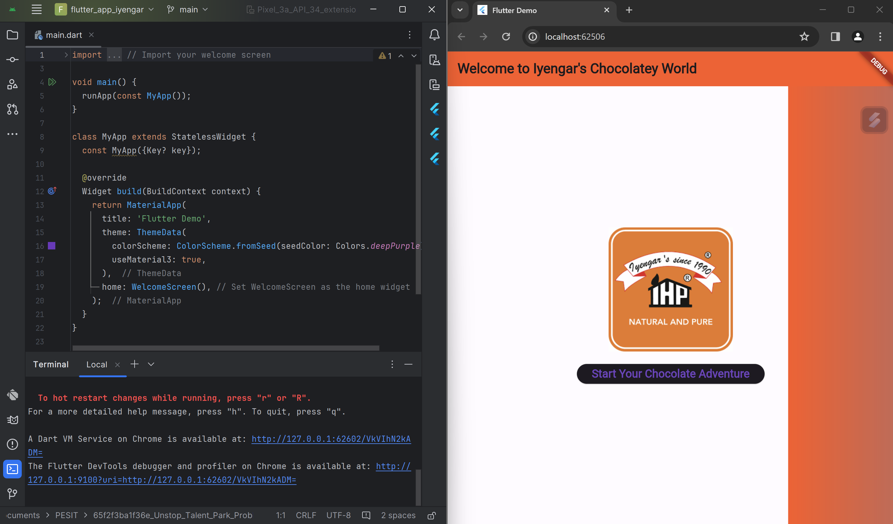

# flutter-project
Flutter app for managing orders for restaurants

## Getting Started
1. Clone the repository to your local machine.
2. Open the project in your preferred IDE or text editor.
3. Run `flutter pub get` to install the project dependencies.
4. Run `flutter run` to launch the app on your device or emulator.

That's it! You should now be able to explore and use the app for managing orders in restaurants.

## Display
## Display
